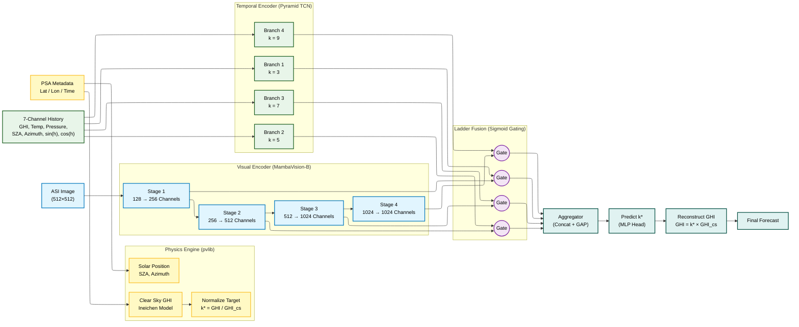
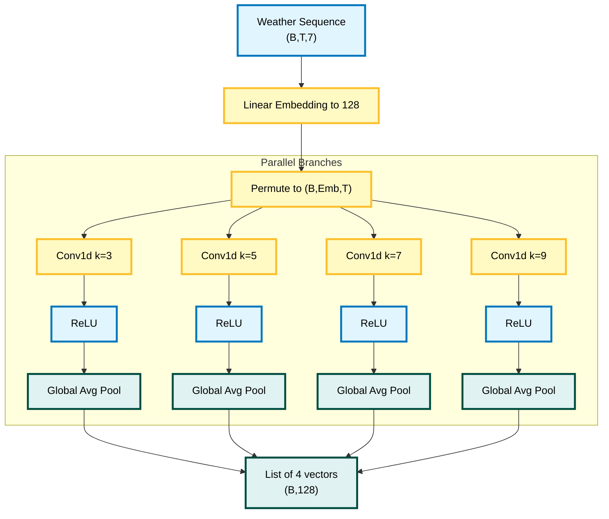
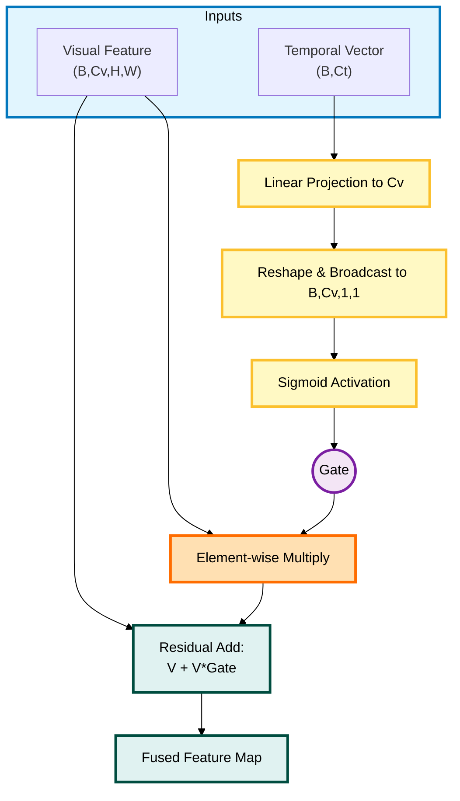
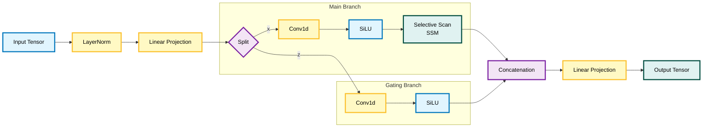

# **SolarMamba Architecture**

SolarMamba is a hybrid physics–deep learning model built to forecast solar irradiance by fusing three information streams:

1. **Physics Engine (pvlib):** Determines the sun's geometry and clear-sky irradiance.
2. **Visual Encoder (MambaVision-B):** Learns spatial–semantic cloud structure from ASI images.
3. **Temporal Encoder (Pyramid TCN):** Learns multi-scale temporal dynamics from meteorological history.
4. **Ladder Fusion:** Injects temporal knowledge into visual features through a hierarchical gating mechanism.

The model predicts the **Clear Sky Index**:

$$
k^* = \frac{\mathrm{GHI}}{\mathrm{GHI}_{\mathrm{cs}}}
$$

The final forecast is reconstructed as:

$$
\widehat{\mathrm{GHI}} = k^* \cdot \mathrm{GHI}_{\mathrm{cs}}
$$

---

# **1. Full Architecture Diagram**

---

## **2. Components**

## **2.1 Visual Encoder — MambaVision-B**

A hierarchical 4-stage MambaVision backbone.

- Stage outputs (visual resolutions shrink, channels expand):
  - Stage 1: $H/4 \times W/4$ → **256 channels**
  - Stage 2: $H/8 \times W/8$ → **512 channels**
  - Stage 3: $H/16 \times W/16$ → **1024 channels**
  - Stage 4: $H/32 \times W/32$ → **1024 channels**

Each stage produces a feature map $V_i$ used in fusion.

## **2.2 Temporal Encoder — Pyramid TCN**

Input sequence:

$$X \in \mathbb{R}^{B \times T \times 7}$$

Channels include:

$$[GHI, T, P, \text{SZA}, \text{Azimuth}, \sin(h), \cos(h)]$$

After a linear embedding to 128 dimensions, four Conv1d branches with different receptive fields capture multi-scale temporal patterns:

| Branch | Kernel Size | Temporal Scale | Output |
|--------|-------------|----------------|--------|
| 1 | 3 | short-range | 128-D |
| 2 | 5 | mid-short | 128-D |
| 3 | 7 | mid-long | 128-D |
| 4 | 9 | long-range | 128-D |

Each branch applies Conv1d → ReLU → Global Average Pooling, producing **pooled embeddings** (not feature maps).

Output:

$$[t_1, t_2, t_3, t_4],\quad t_i \in \mathbb{R}^{B \times 128}$$
---

## **3. Ladder Fusion — Temporal-Conditioned Visual Gating**

Given visual map:

$$V \in \mathbb{R}^{B \times C_v \times H \times W}$$

And temporal vector:

$$T \in \mathbb{R}^{B \times 128}$$

The gate is computed as:

$$g = \sigma(W_t T) \in \mathbb{R}^{B \times C_v}$$

Broadcast spatially to match visual dimensions:

$$g \in \mathbb{R}^{B \times C_v \times H \times W}$$

Fusion (residual gated amplification):

$$V_{\text{out}} = V \odot g + V$$

This injects temporal context without altering spatial resolution or channel dimensions.
---

# **4. Prediction Head**

1. Global Average Pool on the fused visual outputs
2. Concatenate:

$$256 + 512 + 1024 + 1024 = 2816$$

3. MLP:

$$\mathrm{LN} \rightarrow \mathrm{Linear}(2816 \rightarrow 512) \rightarrow \mathrm{GELU} \rightarrow \mathrm{Dropout}(0.5) \rightarrow \mathrm{Linear}(512 \rightarrow 4)$$

Outputs: forecasts at horizons $$[1, 5, 10, 15]$$ minutes.

---

# **5. Detailed Component Diagrams **

---

## **5.1 Pyramid TCN **

Each branch produces a **128-dimensional pooled embedding** through Global Average Pooling, not feature maps. These embeddings are used to modulate corresponding visual stages.

---

## **5.2 Ladder Fusion**

---

## **5.3 Mamba Mixer Block (Exact Mermaid Code)**

